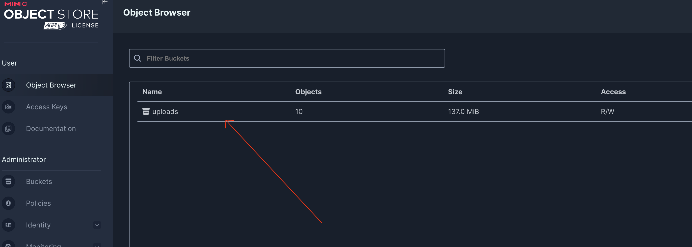
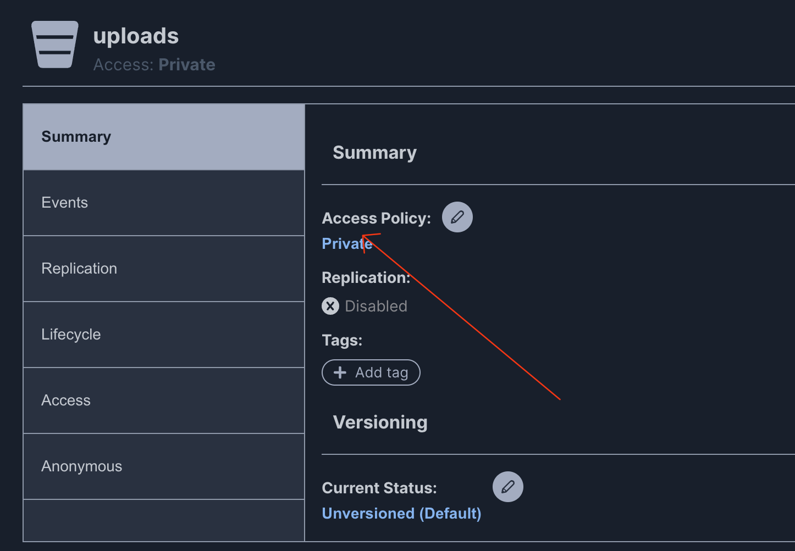
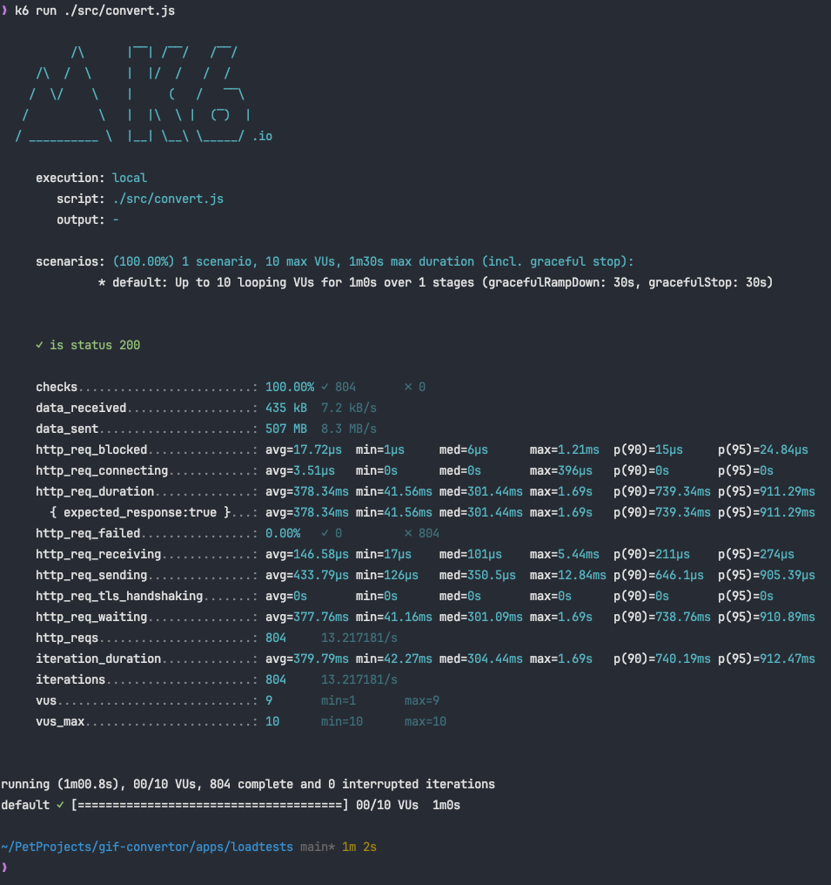
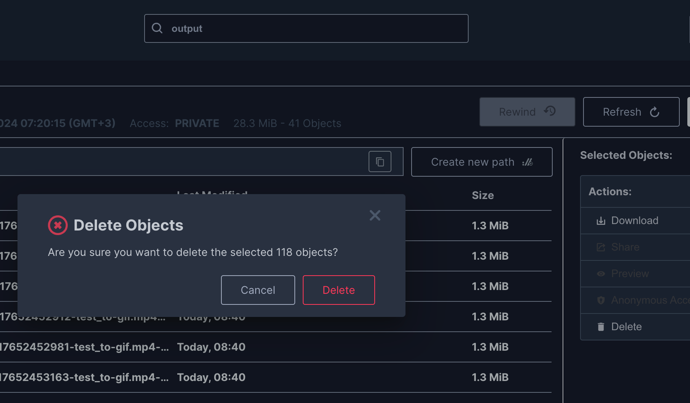

# Gif converter


### Развертывание
- `docker compose up -d`
- Зайти на `http://localhost:9090` (админка minio)
```json
{
  "username": "minio",
  "password": "minio123"
}
```
- Зайти в бакет `uploads`

- Перейти в настройки 

- Frontend запущен по адресу `http://localhost:4200`


### Производительность
Методика нагрузочного тестирования:
- Тест проходил на macbook air m1 8gb ram
- было создано тестовое видео 1024x768 10s `apps/loadtests/assets/test_to-gif.mp4`
- С помощью `k6` запущена загрузка 60 секунд на 10 потоков
- По окончанию минуты было сосчитано количество загруженных gif-файлов в minio
- За минуту с момента запуска теста 5 воркеров сконвертировали 118 gif-файлов


